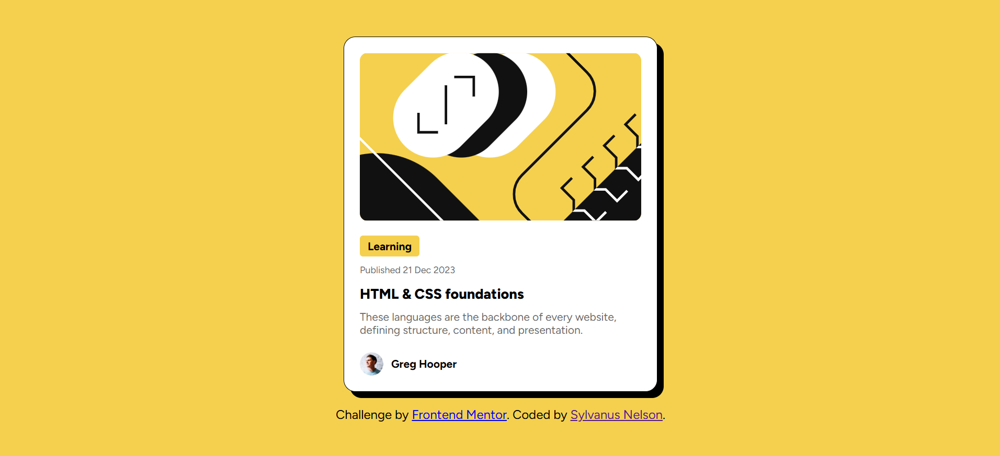

# Frontend Mentor - Blog preview card solution

This is a solution to the [Blog preview card challenge on Frontend Mentor](https://www.frontendmentor.io/challenges/blog-preview-card-ckPaj01IcS). Frontend Mentor challenges help you improve your coding skills by building realistic projects. 

## Table of contents

- [Overview](#overview)
  - [The challenge](#the-challenge)
  - [Screenshot](#screenshot)
  - [Links](#links)
- [My process](#my-process)
  - [Built with](#built-with)
  - [What I learned](#what-i-learned)
  - [Continued development](#continued-development)
- [Author](#author)


## Overview

### The challenge

Users should be able to:

- See hover and focus states for all interactive elements on the page

### Screenshot




### Links

- Solution URL: https://github.com/Ugokams/frontend-mentor-project/blob/master/blog-preview-card/index.html
- Live Site URL: https://ugokams.github.io/frontend-mentor-project/ 

## My process

### Built with

- Semantic HTML5 markup
- CSS custom properties
- Flexbox
- Responsive design


### What I learned

What I Learned:
Setting image widths to 100% inside containers ensures they scale with the layout.

Why It Matters:
Prevents layout breaking on smaller screens.

```html
<div class="card">
  
</div>
```
```css
.card img{
    width: 100%;
    border-radius: 10px;
}
```


### Continued development

- Media Queries Best Practices
- Touch-Friendly UI Elements
- Simplified Navigation
- Responsive Typography


## Author

- Frontend Mentor - [@ugokams](https://www.frontendmentor.io/profile/ugokams)
- Twitter - [@SylvanusNe75846](https://www.twitter.com/SylvanusNe75846)
